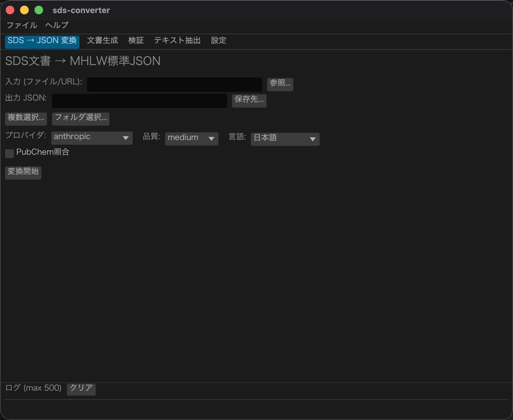
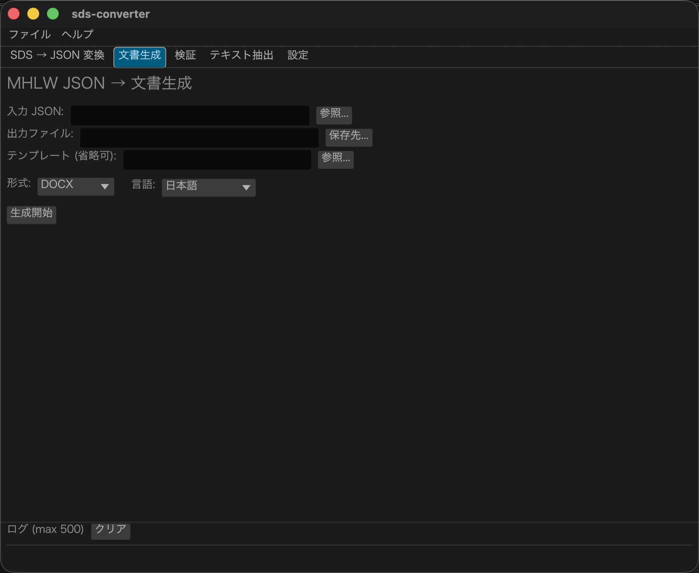
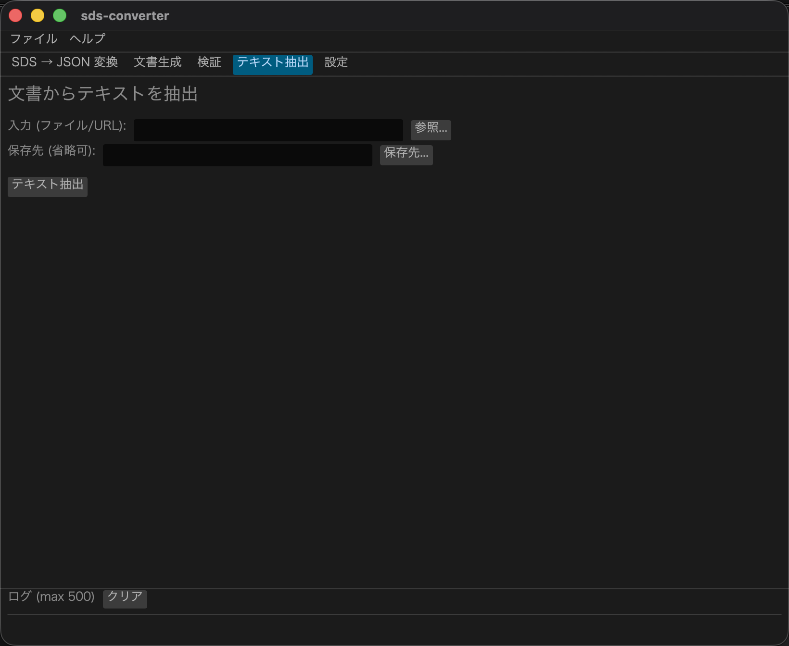

# sds-converter

用于**双向转换**安全数据表（SDS）文档（Word/PDF）与日本厚生劳动省（MHLW）标准JSON格式的GUI + CLI工具。

支持**日语、英语、简体中文、繁体中文**的SDS文档处理。

[English](README.md) | [日本語](README_ja.md)

---

## 下载

| 平台 | 下载 |
|---|---|
| **macOS**（Homebrew） | `brew tap kent-tokyo/sds-converter && brew install --cask sds-converter` |
| **Windows**（便携版 .exe — 无需安装） | [sds-converter-windows-portable.zip](https://github.com/kent-tokyo/sds-converter/releases/latest/download/sds-converter-windows-portable.zip) |
| **Rust / CLI** | `cargo install sds-converter` |

→ [全部版本与更新日志](https://github.com/kent-tokyo/sds-converter/releases)

> **Windows 注意事项：** 若 SmartScreen 显示「Windows 已保护你的电脑」，请点击**「更多信息」→「仍要运行」**。

---

## GUI界面

无参数运行 `sds-converter`（或双击下载的应用程序）即可启动图形界面：

```bash
sds-converter
```

将打开包含五个标签页的窗口：

| 标签页 | 功能 |
|---|---|
| **转换** | SDS文档（PDF/DOCX/XLSX/HTML/URL）→ MHLW标准JSON |
| **文档生成** | MHLW JSON → DOCX / HTML / PDF（支持DOCX模板） |
| **验证** | MHLW JSON结构验证（✅⚠❌彩色显示） |
| **文本提取** | 从文档提取原始文本（无需LLM API） |
| **设置** | API密钥、模型名称、Base URL、质量、语言、界面语言 |

| 转换标签页 | 文档生成标签页 | 文本提取标签页 |
|---|---|---|
|  |  |  |

将文件**拖放**至任意标签页可自动填充输入字段。
设置保存至 `~/.config/sds-converter/config.toml`，下次启动时自动恢复。

---

## 功能特点

- **SDS文档 → JSON**: 从PDF/DOCX/XLSX/TXT/**HTML/URL**中提取文本，并转换为符合MHLW SDS数据交换标准格式v1.0的JSON。支持并行提取与自动重试。
- **JSON → DOCX**: 从标准JSON生成符合JIS Z 7253规范的16节Word文档，支持多语言节标题。
- **JSON → HTML**: 生成包含内联CSS和`@media print`支持的自包含UTF-8 HTML5文档（`to-html`）。
- **JSON → PDF**: 通过LibreOffice CLI转换为PDF（`to-pdf`，需要`soffice`）。
- **GHS/CAS验证**: 依据GHS Rev.10验证H码（H200–H420）和P码（P101–P503），验证CAS编号格式及校验位。支持`--enrich`标志通过PubChem交叉核验成分信息。
- **多语言支持**: 支持 `ja` / `en` / `zh-CN` / `zh-TW` 的输入和输出。
- **可扩展LLM后端**: 内置Anthropic Claude、OpenAI GPT、Google Gemini、Mistral、Groq、Cohere实现。通过实现 `LlmBackend` trait可接入任意LLM。
- **库 + CLI**: 可作为Rust库嵌入使用，也可作为独立命令行工具使用。

---

## 为何使用LLM？

SDS文档是**非结构化的自然语言文本**，而非电子表格。即使遵循同一标准，不同文档之间也存在以下差异：

- **章节顺序不同** — 各厂商对16节的排列顺序各有不同
- **表述方式多样** — 同一数据可能写作"≥99.5%"、"99.5%以上"或"含量约100%"等不同形式
- **标题名称各异** — JIS Z 7253、GHS/OSHA HazCom、GB/T 16483、CNS 15030对同一概念使用不同标签
- **多语言混用** — 日语SDS中常混有英语化学品名和CAS编号

MHLW标准JSON格式包含**约200个深度嵌套的字段**。为每种文档格式编写基于规则的解析器几乎不可行。LLM能像人类一样阅读文档，无论格式如何，都能将自由文本映射到正确的模式字段，并原生支持多语言文档。

通过`LlmBackend` trait，LLM后端可灵活替换，支持Claude、GPT-4o、Gemini或未来的任何新模型。

---

## 快速开始

```bash
# 安装CLI工具
cargo install sds-converter

# PDF → MHLW标准JSON
export ANTHROPIC_API_KEY=sk-ant-...
sds-converter to-json --input input.pdf --output output.json

# 直接从URL转换
sds-converter to-json --input https://example.com/sds.html --output output.json

# JSON → Word文档
sds-converter to-docx --input output.json --output result.docx --lang zh-cn

# JSON → HTML（支持打印，A4）
sds-converter to-html --input output.json --output result.html --lang zh-cn

# JSON → PDF（需要LibreOffice）
sds-converter to-pdf --input output.json --output result.pdf --lang zh-cn

# 验证JSON（含GHS编码和CAS编号验证）
sds-converter validate --input output.json

# 转换并通过PubChem交叉核验成分（--enrich）
sds-converter to-json --input input.pdf --output output.json --enrich
```

完整CLI参考请查看 [`sds-converter` README](./sds_converter/README.md)，库API请查看 [`sds-converter-core` README](./sds_converter_core/README.md)。

---

## 开发者

| 包 | 说明 |
|---|---|
| [`sds-converter`](https://crates.io/crates/sds-converter) | CLI + GUI工具（本工具） |
| [`sds-converter-core`](https://crates.io/crates/sds-converter-core) | Rust库 — LLM提取、DOCX/HTML生成、MHLW模式 |

嵌入Rust项目：

```toml
[dependencies]
sds-converter-core = "0.2"
```

---

## 语言支持

| 语言 | `--lang` | 源文档格式 | 输出DOCX标题 |
|---|---|---|---|
| 日语 | `ja` | JIS Z 7253标准SDS | JIS Z 7253 |
| 英语 | `en` | GHS/OSHA HazCom格式 | GHS Rev.10 / ISO 11014 |
| 简体中文 | `zh-cn` | GB/T 16483格式 | GB/T 16483-2012 |
| 繁体中文 | `zh-tw` | CNS 15030格式 | CNS 15030 |

---

## 与同类产品对比

### 开源工具

| | **sds-converter**（本工具） | [sds_parser](https://github.com/astepe/sds_parser) | [tungsten](https://github.com/CrucibleSDS/tungsten) |
|---|---|---|---|
| 语言 | Rust | Python | Python |
| AI/LLM | 有（可替换） | 无（正则表达式） | 无（规则驱动） |
| MHLW JSON | 有 | 无 | 无 |
| 双向转换 | 有（DOCX + HTML + PDF） | 无 | 无 |
| HTML/URL输入 | 有 | 无 | 无 |
| GHS/CAS验证 | 有 | 无 | 无 |
| 多语言 | ja / en / zh-CN / zh-TW | 有限 | 仅英文 |

### 商业产品（日本）

| | **sds-converter**（本工具） | [SDS Meister](https://www.kcs.co.jp/ja/service/ind/general/chemical/sds.html) | [SmartSDS](https://smartsds.jp/) | [Dr.EHS Chemical](https://www.iad.co.jp/drehs/chemical2/) |
|---|---|---|---|---|
| 提供商 | — | さくらケーシーエス | テクノヒル | アイアンドディー |
| AI | 有（自备API密钥） | 无 | 有（翻译） | AI-OCR |
| MHLW JSON | 有 | 有 | 有 | 有 |
| PDF→JSON | 有 | 无（仅创作） | 部分（仅日语） | 有 |
| 开源 | 有（MIT/Apache-2.0） | 无 | 无 | 无 |

### 商业产品（全球）

| | **sds-converter**（本工具） | [Affinda](https://www.affinda.com/documents/material-safety-data-sheet) | [SDS Manager API](https://sdsmanager.com/) | [safetydatasheetapi.com](https://safetydatasheetapi.com/) | [EcoOnline](https://www.ecoonline.com/) |
|---|---|---|---|---|---|
| AI/LLM | 可替换LLM | LLM（自适应） | NLP/ML | ML + OCR | AI/NLP |
| 输入 | PDF / DOCX | PDF / Word | PDF | PDF（含扫描件） | PDF |
| 输出 | MHLW JSON + DOCX | 自定义JSON | JSON / XML | JSON / XML / CSV | 仅内部数据 |
| 开源 | 有 | 无 | 无 | 无 | 无 |

**本工具的核心优势**：唯一支持MHLW标准JSON、双向转换（JSON→DOCX/HTML/PDF）、无需云订阅的本地运行、GHS Rev.10验证、PubChem富集以及可替换LLM后端的开源解决方案。

---

## 路线图

### 下一版本（0.3.x）
- [ ] DOCX表格布局 — 第3节成分信息（4列）、第2节H/P编码（2列）、第9节物化性质（2列）

### 计划中
- [x] GUI应用程序（eframe/egui）— 转换/生成/验证/文本提取/设置标签页，支持拖放、配置持久化和三语言界面
- [x] 发布至crates.io（`sds-converter-core` + `sds-converter`）
- [ ] 在HTML和DOCX输出中嵌入GHS象形图

### 依赖外部进展
- [x] 纯Rust PDF生成 — [`harumi`](https://crates.io/crates/harumi) v0.4.0 的 `html` feature 中 `render_html_to_pdf` 现已可用
- [x] 扫描PDF的OCR支持 — `pdftoppm` + `tesseract` CLI自动回退（文本提取少于200字时自动触发）

---

## 参考链接

- [厚生劳动省 — SDS信息交换标准格式发布页面](https://www.mhlw.go.jp/stf/newpage_56484.html)（日语）
- [SDS数据交换格式开发者手册（PDF）](https://www.mhlw.go.jp/content/11305000/001467068.pdf)（日语）

---

## 许可证

以下两种许可证任选其一：
- Apache License, Version 2.0
- MIT License
